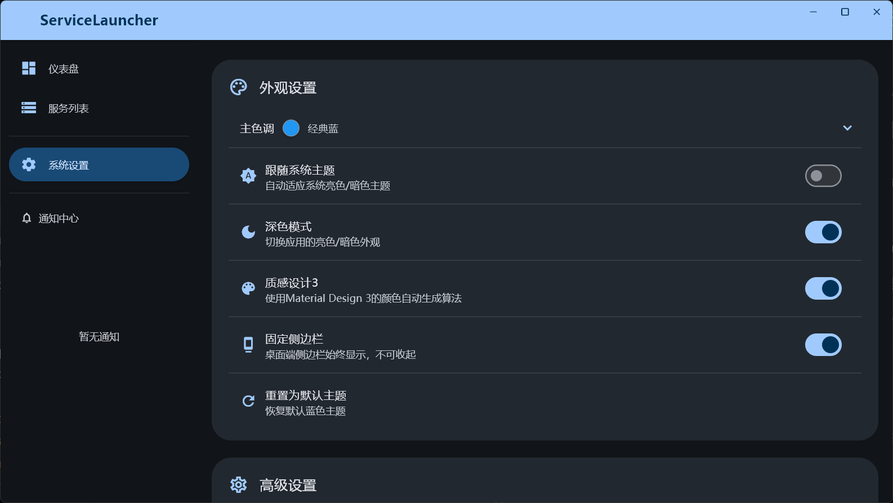
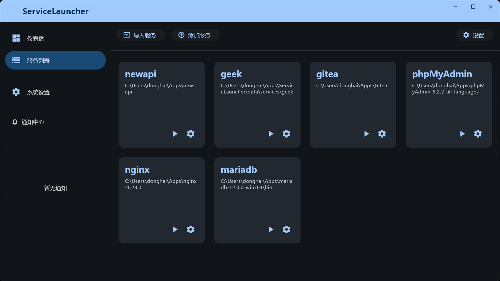
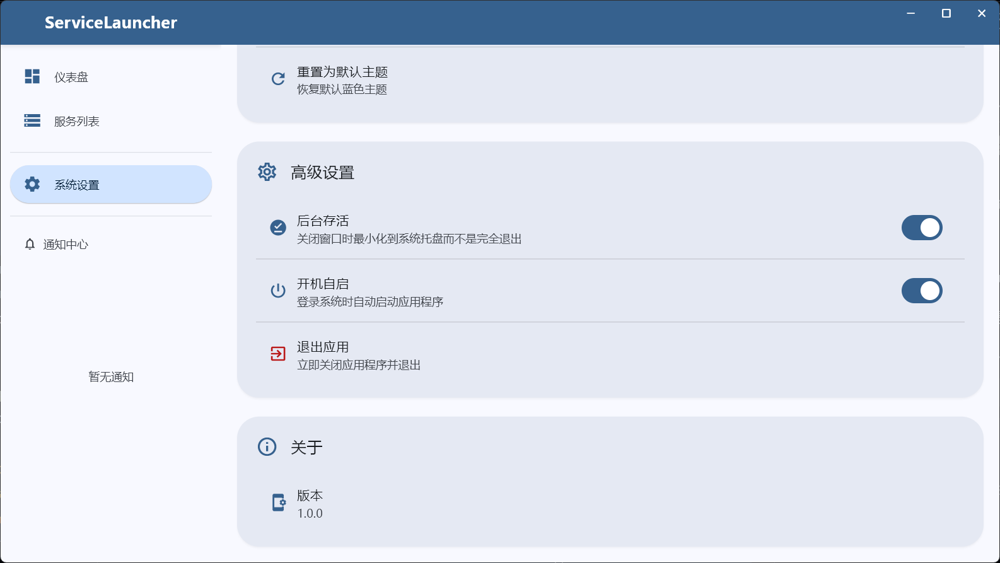
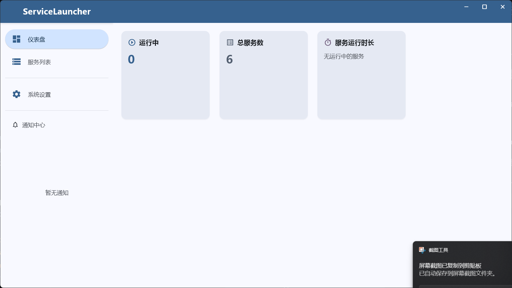
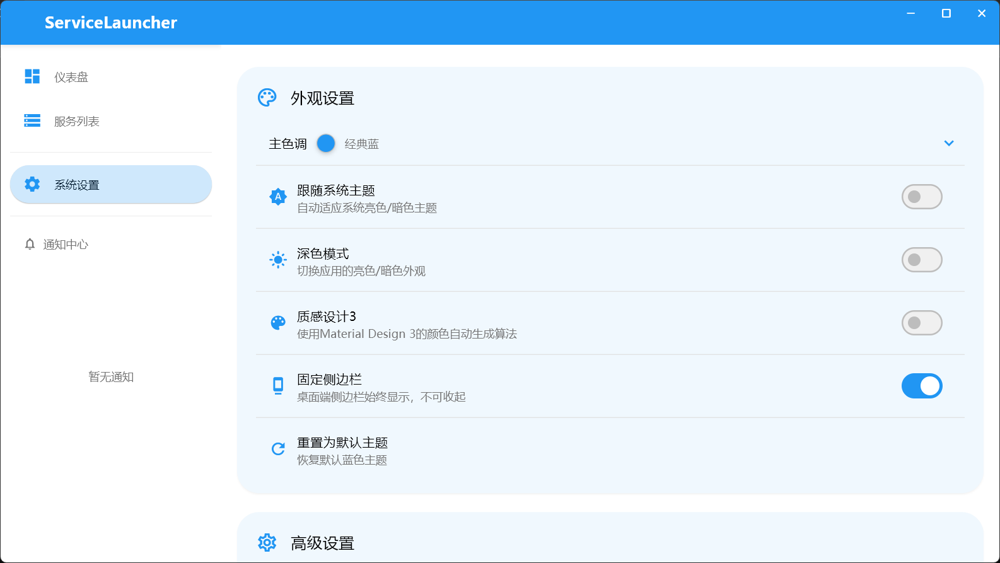
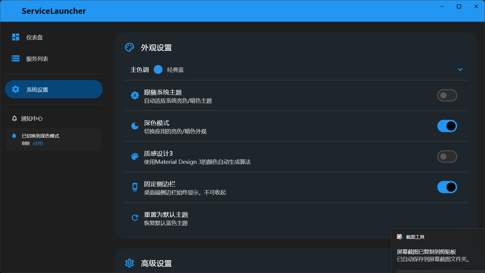
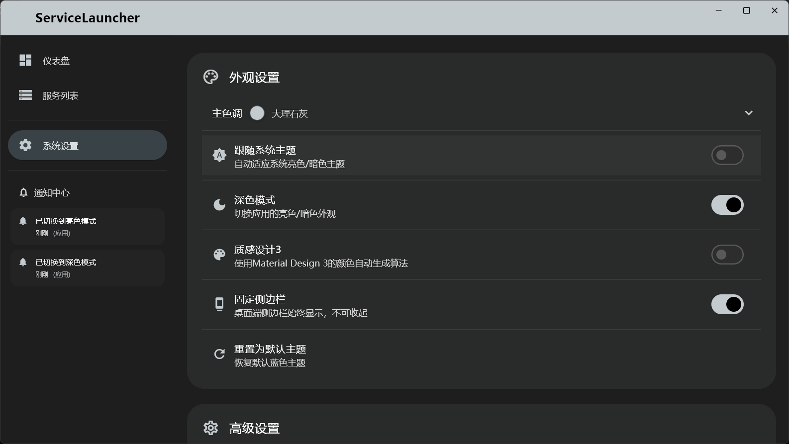

# ServiceLauncher

[ServiceLauncher Icon](assets/icons/app_icon.png)

[GitHub Repository](https://github.com/haiyewei/ServiceLauncher)

一个用于管理和启动服务的桌面应用程序。

## 功能特性

* **服务仪表盘:** 集中展示所有已配置的服务及其状态。 (示例见截图 1)
    

* **服务管理:** 方便地添加、编辑和删除服务配置。 (示例见截图 2、3)
    
    

* **一键启停:** 快速启动或停止选定的服务。 (示例见截图 4)
    

* **实时日志:** 查看服务的实时输出日志。 (示例见截图 5)
    

* **应用设置:** 配置应用程序行为，例如主题切换。 (示例见截图 6)
    

* **系统托盘集成:** 支持最小化到系统托盘，方便后台运行和快速访问。 (功能示意)
    
